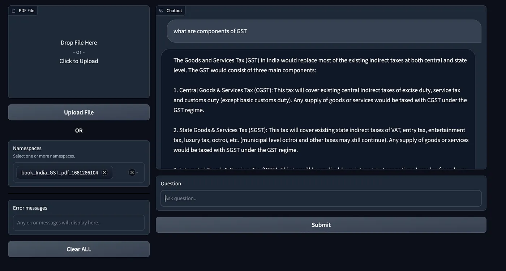

# PDF-GPT: An App for Easy Information Extraction from PDFs
PDF-GPT is an innovative app designed to simplify the process of extracting information from PDFs. It generates embeddings for small chunks of text within a PDF and can then search for the most relevant answer to a given question. This app has a number of features that make it stand out from other information extraction tools:

## Features of PDF-GPT

1. **Context-based answers**: PDF-GPT will not provide answers to questions that are not present in the context of the PDF. This ensures that the answers provided are accurate and relevant to the source material.

2. **Multiple PDF search**: The app can search for answers across multiple PDFs at the same time. This is particularly useful when you need to find information from various sources or when you are unsure which document contains the answer to your question.

3. **Efficient follow-up questions**: PDF-GPT can efficiently answer follow-up questions based on previous questions. This feature allows for a more interactive and dynamic information extraction process.

## How to use

1. Install dependancies. `pip install -r requirement.txt`
2. Add your openai api key in `config.py`
3. Add pdf:
```python
# Code for uploading the PDF and processing the text will be added here.
from pdfgpt import PDFGPT

pdf_gpt = PDFGPT()
filepath = "path/to/file.pdf"
op = pdf_gpt.add_pdf(filepath)
namespace = op["namespace"]
print(namespace)
```
This will gereate `.bin` file under `marshal_storage` and returns the namespace (unique for each pdf). We will need this namespace in next step.
> This namespace is just name of binary file under folder `marshal_storage` of your current working directory without `.bin` extension.
 This file will be permenant, hence we can use this namespace repeatedly to answer questions, without processing pdf again.
4. Answer question
```python
from pdfgpt import PDFGPT

pdf_gpt = PDFGPT()
# This can be list of one or more namespaces, as long as corresponding .bin file present in marshal_storage folder
namespace = ["book_India_GST_pdf_1681286104"]
pdf_gpt.set_namespaces([namespace])
question = "what explain in simple terms"
for val in pdf_gpt.answer_question(question):
    print(val, end="", flush=True)
```
This will provide output instreaming format.

## Run using Gradio
You can also try PDF-GPT by using user-interface.

Just run `python run_gradio.py`.

It will open web interface on url `http://127.0.0.1:7860` . Select namespace and ask question. Namespaces will auto populate based on binary files in marshal_storage folder.


## Limitations
Here instead of using any `vectorstore` , I'm storing embeddings just in binary file locally, cause I wanted to make it simple. 
It will work pretty well till you have embeddings count less than 15000 (book with around 2000 pages) and will provide results in less than second.

>Checkout medium article for this: https://medium.com/@hrushikeshvanga777/introducing-pdf-gpt-2e619b964cc3
